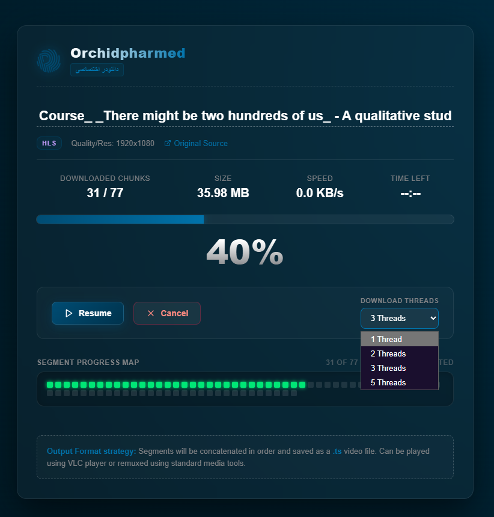
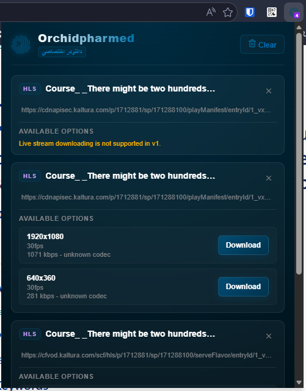
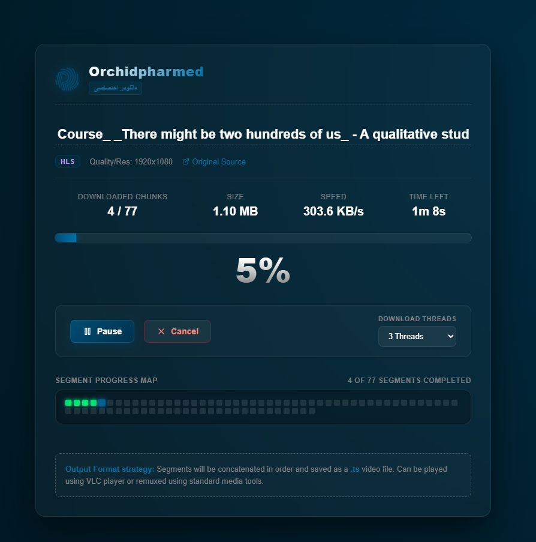

[🇬🇧 English](README.md) | [🇮🇷 فارسی](README-fa.md)

# اکستنشن دانلودر ویدیو ارکید (Orchid Video Downloader)

دانلودر ویدیوی ارکید یک افزونه (اکستنشن) تمیز و امن برای گوگل کروم (Manifest V3) است که برای تشخیص، تجزیه و دانلود استریم‌های ویدیویی پخش شده در مرورگر طراحی شده است. این افزونه به صورت امن و با حفظ حریم خصوصی و قوانین کپی‌رایت، ویدیوهای HLS (`.m3u8`)، DASH (`.mpd`) و فرمت‌های عادی (`.mp4`, `.webm`) را رهگیری و دانلود می‌کند.

## تصاویر محیط افزونه

<div align="center" dir="ltr">
  
  
  
</div>

## امکانات

- **تشخیص غیرفعال استریم**: با بررسی هدرها و ترافیک شبکه بدون تزریق کد به صفحات وب، لینک‌های ویدیو را شناسایی می‌کند.
- **تجزیه پلی‌لیست‌های VOD**: فرمت‌های مختلف کیفیت (رزولوشن، پهنای باند، کدک‌ها) را از فایل‌های m3u8 استخراج می‌کند.
- **دانلود موازی (Threaded)**: بخش‌های ویدیوی HLS را همزمان دانلود می‌کند تا سرعت دانلود بالا برود (قابل تنظیم روی 1, 2, 3, 5 اتصال همزمان).
- **کش روی حافظه محلی**: از IndexedDB برای ذخیره قطعات دانلود شده استفاده می‌کند تا رم سیستم درگیر دانلودهای حجیم نشود.
- **تلاش مجدد هوشمند**: در صورت قطعی شبکه، دانلود قطعات را با تاخیرهای تصاعدی به صورت خودکار دوباره امتحان می‌کند.
- **حفظ ترتیب قطعات**: قطعات TS دانلود شده را با ترتیب درست به هم متصل کرده و به عنوان یک فایل امن از طریق دانلودر داخلی کروم ذخیره می‌کند.
- **معماری مبتنی بر امنیت**: 
  - بررسی و مسدودسازی لینک‌های غیرمجاز (لوکال هاست، IP های خصوصی، پروتکل‌های غیر http).
  - پاک‌سازی اطلاعات حساس از لاگ‌ها (توکن‌ها، JWTها، کلیدهای احراز هویت).
  - تشخیص ویدیوهای قفل‌دار (DRM) و جلوگیری از دانلود غیرمجاز آن‌ها.

## آموزش نصب در کروم

### برای استفاده کنندگان (کاربران عادی)
۱. به صفحه [Releases (نسخه‌ها)](https://github.com/ChosoMeister/Orchid-Video-Downloader/releases) در گیت‌هاب بروید و آخرین نسخه فایل `orchid-downloader.zip` را دانلود کنید.
۲. فایل زیپ را در یک پوشه روی سیستم خود از حالت فشرده خارج کنید (Extract).
۳. مرورگر کروم را باز کنید و آدرس `chrome://extensions/` را در نوار آدرس وارد کنید.
۴. گزینه **Developer mode** را از گوشه بالا سمت راست فعال کنید.
۵. روی دکمه **Load unpacked** در بالا سمت چپ کلیک کنید.
۶. پوشه‌ای که از فایل زیپ استخراج کرده بودید را انتخاب کنید.

### برای برنامه‌نویسان (بیلد سورس کد)
۱. سورس کد را از گیت‌هاب کلون یا دانلود کنید.
۲. با استفاده از npm پروژه را بیلد کنید:
   ```bash
   npm install
   npm run build
   ```
۳. مراحل ۳ تا ۶ بالا را تکرار کنید، با این تفاوت که پوشه `dist/` که بعد از بیلد ساخته شده است را انتخاب کنید.

## ساختار پروژه

- `extension/public/` - فایل‌های استاتیک مثل `manifest.json` و لوگوها.
- `extension/src/background/` - بخش پردازش پس‌زمینه برای تشخیص استریم‌ها.
- `extension/src/popup/` - منوی اصلی افزونه برای نمایش ویدیوهای پیدا شده در تب فعلی.
- `extension/src/downloader/` - صفحه اختصاصی دانلودر برای نمایش پروسه دانلود و قطعات در حال دانلود.
- `extension/src/lib/` - ماژول‌های پردازش فایل، موتور دانلود، دیتابیس و اعتبارسنجی‌های امنیتی.
- `tests/` - تست‌های نرم‌افزاری برای بررسی عملکرد پردازنده‌ها و امنیت.
- `native-helper/` - راهنمای ایجاد برنامه کمکی برای تبدیل و ترکیب فایل‌های MP4 به کمک ffmpeg.

## محدودیت‌های فعلی (نسخه ۱)

۱. **ویدیوهای رمزنگاری شده / DRM**: دور زدن قفل‌های کپی‌رایت (Widevine, PlayReady و غیره) به هیچ وجه پشتیبانی نمی‌شود و این ویدیوها غیرقابل دانلود مشخص خواهند شد.
۲. **پخش زنده (Live Streams)**: استریم‌های زنده HLS/DASH در این نسخه شناسایی می‌شوند اما قابل دانلود نیستند.
۳. **اتصال فرمت MPEG-TS**: در حال حاضر قطعات HLS به شکل فایل `.ts` ذخیره می‌شوند. برای تبدیل فایل خروجی به `.mp4` به استفاده از نرم‌افزارهای مبدل جانبی مانند `ffmpeg` نیاز است.

## تست افزونه

می‌توانید عملکرد افزونه را روی صفحات تستی بدون قفل HLS بررسی کنید:
- [Bitmovin HLS Test Player](https://bitmovin.com/demos/stream-test)
- [VideoJS HLS Demo](https://videojs.github.io/videojs-contrib-hls/)
- [HLS.js Demo](https://video-dev.github.io/hls.js/demo/)

کافیست یکی از ویدیوها را در این صفحات پخش کنید و سپس روی آیکون ارکید در بالای مرورگر کلیک کنید تا کیفیت مورد نظر خود را برای دانلود انتخاب نمایید.
