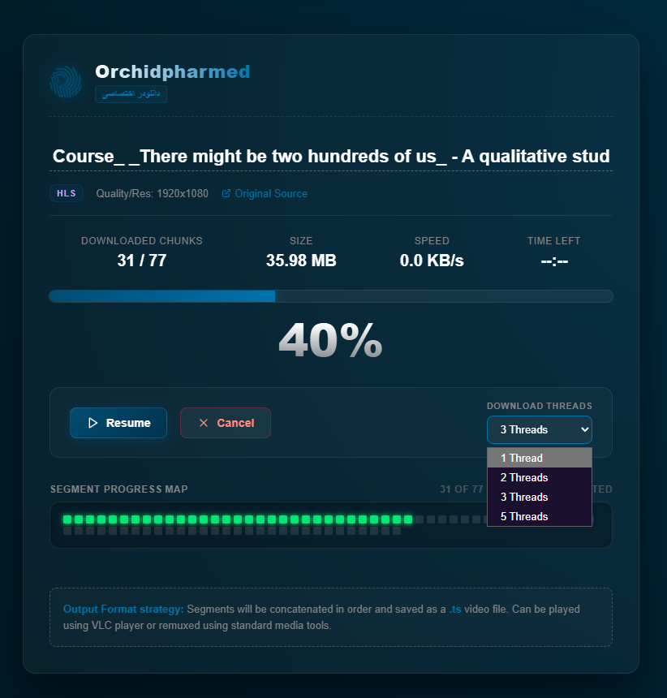
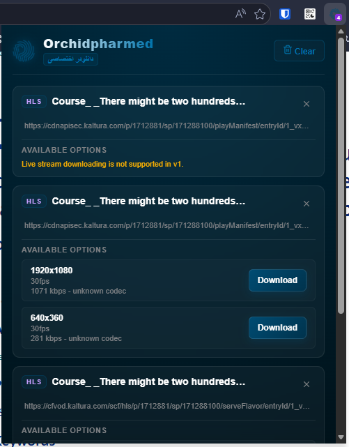
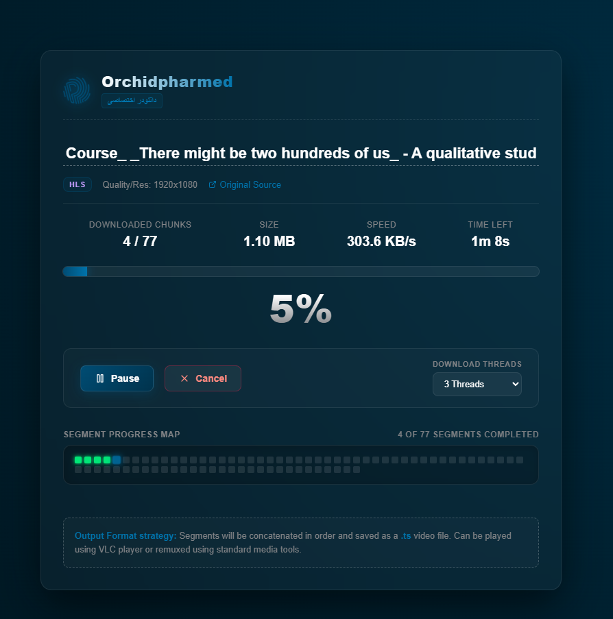

<div align="center" dir="rtl">
  

  # دانلودر ویدیوی ارکید

  **ویدیویی را که در مرورگر پخش می‌شود، با انتخاب کیفیت، نمایش دقیق پیشرفت و بدون سرویس واسط ابری روی سیستم خود ذخیره کنید.**

  [English](README.md) · [فارسی](README-fa.md)

  [دریافت آخرین نسخه](https://github.com/ChosoMeister/Orchid-Video-Downloader/releases/latest) · [طراحی امنیتی](SECURITY.md) · [ساخت از سورس](#ساخت-از-سورس)
</div>

---

<div dir="rtl">

## مرورگر پخشش می‌کند؛ ارکید استریم را پیدا می‌کند

ویدیوهای امروزی همیشه یک فایل MP4 ساده نیستند. بسیاری از آن‌ها به‌صورت پلی‌لیست HLS، مانیفست DASH، قطعات متعدد، لینک‌های امضاشده و کیفیت‌های جداگانه تحویل داده می‌شوند. ارکید این پیچیدگی فنی را به یک تجربهٔ دانلود متمرکز و قابل‌کنترل در Chrome تبدیل می‌کند.

ویدیو را پخش کنید، افزونه را باز کنید، استریم یا کیفیت موردنظر را انتخاب کنید و ادامهٔ کار را به ارکید بسپارید. دیگر نیازی به جست‌وجوی دستی لینک، زیروروکردن Developer Tools یا ارسال اطلاعات رسانه به سایت‌های تبدیل آنلاین نیست.

> ارکید برای رسانه‌های عمومی و رمزنگاری‌نشده‌ای ساخته شده است که اجازهٔ دانلودشان را دارید. این افزونه DRM، دیوار پرداخت، احراز هویت یا محدودیت دسترسی را دور نمی‌زند.

## ارکید در عمل

</div>

<div align="center" dir="ltr">
  
  
  
</div>

<div dir="rtl">

## چرا تجربهٔ ارکید متفاوت است؟

### تشخیص خودکار استریم

ارکید درخواست‌های رسانه‌ای تب فعال را بررسی می‌کند و HLS (`.m3u8`)، DASH (`.mpd`)، فایل‌های مستقیم MP4/WebM/MOV و پاسخ‌های پشتیبانی‌شدهٔ Vimeo را تشخیص می‌دهد؛ بدون اینکه اسکریپتی به صفحهٔ وب تزریق کند.

### انتخاب کیفیت مناسب

پلی‌لیست‌های اصلی به گزینه‌های قابل‌فهمی مانند رزولوشن، نرخ فریم، پهنای باند و کدک تبدیل می‌شوند. شما کیفیت موردنظر را انتخاب می‌کنید؛ نه یک گزینهٔ تصادفی و ازپیش‌تعیین‌شده.

### دانلود سریع‌تر و بازیابی هوشمندتر

قطعات رسانه با تعداد اتصال قابل‌تنظیم به‌صورت هم‌زمان دانلود می‌شوند. درخواست‌های ناموفق با تأخیر تصاعدی دوباره امتحان می‌شوند و تمام قطعات با ترتیب صحیح کنار یکدیگر قرار می‌گیرند.

### پردازش روی سیستم خودتان

ارکید هیچ endpoint تحلیلی، مبدل آنلاین یا سرور پردازش رسانه‌ای ندارد. تشخیص، تجزیه، نگهداری موقت قطعات، اتصال فایل و ادغام صوت و تصویر پشتیبانی‌شده، همگی به‌صورت محلی در مرورگر انجام می‌شوند.

## آماده برای استریم‌های پیچیده

| قابلیت | نتیجه برای شما |
| --- | --- |
| تجزیهٔ HLS | تشخیص پلی‌لیست اصلی و رسانه، استخراج کیفیت‌ها و قطعات VOD |
| تجزیهٔ DASH | شناسایی representationها همراه رزولوشن، پهنای باند و MIME |
| رسانهٔ مستقیم | پشتیبانی از پاسخ‌های MP4، WebM، MOV و M4V |
| ترک‌های Vimeo | پردازش جداگانهٔ صوت و تصویر و ادغام داخل مرورگر با FFmpeg WebAssembly |
| موتور دانلود موازی | انتخاب ۱، ۲، ۳ یا ۵ اتصال هم‌زمان |
| کش محلی قطعات | استفاده از IndexedDB برای کاهش فشار حافظه در دانلودهای بزرگ‌تر |
| انتقال مقاوم | تلاش مجدد خودکار با تأخیر تصاعدی هنگام خطاهای موقت شبکه |
| پایش زنده | درصد، نقشهٔ قطعات، حجم منتقل‌شده، سرعت و زمان تقریبی |
| توقف و ادامه | کنترل دانلود قطعه‌ای از صفحهٔ اختصاصی دانلودر |

## حریم خصوصی و امنیت، بخشی از خود محصول‌اند

ارکید بر پایهٔ Chrome Manifest V3 و با معماری کاملاً محلی ساخته شده است:

- بدون telemetry، ردیابی، لاگ‌برداری راه‌دور یا API تبدیل شخص ثالث.
- بدون جمع‌آوری Cookie یا هدر Authorization.
- فقط هدرهای `Referer`، `Origin` و `User-Agent` موردنیاز برای دریافت سازگار رسانه، به‌صورت موقت نگهداری می‌شوند.
- پارامترهای حساس لینک مانند token، signature و session در رابط کاربری مخفی می‌شوند.
- localhost، آدرس loopback، شبکه‌های خصوصی و پروتکل‌های غیر HTTP رد می‌شوند.
- استریم‌های رمزنگاری‌شده یا دارای DRM تشخیص داده شده و پشتیبانی‌نشده علامت می‌خورند.
- تمام کدهای اجرایی و فایل‌های FFmpeg WebAssembly همراه خود افزونه بسته‌بندی شده‌اند.

جزئیات بیشتر در [سند امنیت و انطباق](SECURITY.md) آمده است.

## نصب ارکید

### آخرین نسخهٔ آماده

۱. فایل `orchid-downloader.zip` را از [آخرین نسخهٔ GitHub](https://github.com/ChosoMeister/Orchid-Video-Downloader/releases/latest) دریافت کنید.
۲. فایل ZIP را در یک پوشهٔ دائمی Extract کنید.
۳. آدرس `chrome://extensions/` را در Google Chrome باز کنید.
۴. گزینهٔ **Developer mode** را فعال کنید.
۵. روی **Load unpacked** کلیک کرده و پوشهٔ استخراج‌شده را انتخاب کنید.
۶. ارکید را به نوار ابزار Pin کنید، یک ویدیوی مجاز را پخش کنید و افزونه را باز کنید.

> انتشار در Chrome Web Store در حال آماده‌سازی است. تا آن زمان، جدیدترین build بسته‌بندی‌شده از بخش GitHub Releases قابل دریافت است.

## چهار قدم از پخش تا فایل

۱. ویدیو را **پخش کنید** تا درخواست رسانه‌ای آن در مرورگر ایجاد شود.
۲. **ارکید را باز کنید** و فرمت‌ها و کیفیت‌های شناسایی‌شده را ببینید.
۳. برای گزینهٔ موردنظر روی **Download** بزنید.
۴. پیشرفت را در صفحهٔ دانلودر **کنترل و فایل را ذخیره کنید**.

## ساخت از سورس

پیش‌نیاز: Node.js نسخهٔ ۱۸ یا جدیدتر و npm.

</div>

```bash
git clone https://github.com/ChosoMeister/Orchid-Video-Downloader.git
cd Orchid-Video-Downloader
npm install
npm test
npm run build
```

<div dir="rtl">

سپس پوشهٔ تولیدشدهٔ `dist/` را از طریق گزینهٔ **Load unpacked** در `chrome://extensions/` بارگذاری کنید.

## نمای فنی پروژه

</div>

```text
extension/src/background/   تشخیص درخواست‌های رسانه و وضعیت هر تب
extension/src/popup/        رابط نمایش استریم و انتخاب کیفیت
extension/src/downloader/   کنترل انتقال، پیشرفت، اتصال قطعات و ذخیره
extension/src/lib/hls/      تجزیه‌کنندهٔ پلی‌لیست HLS
extension/src/lib/dash/     تجزیه‌کنندهٔ مانیفست DASH
extension/src/lib/vimeo/    تجزیه‌کنندهٔ پلی‌لیست و ترک‌های Vimeo
extension/src/lib/download/ موتور دانلود موازی و راهبرد تلاش مجدد
extension/src/lib/storage/  نگهداری قطعات در IndexedDB
extension/src/lib/security/ اعتبارسنجی URL، مخفی‌سازی داده و پاک‌سازی نام فایل
tests/                      تست‌های امنیت، دانلود و parserها
```

<div dir="rtl">

نسخهٔ نهایی با TypeScript و Vite ساخته می‌شود. GitHub Actions پروژه را build کرده و از شاخهٔ `main` یک ZIP آمادهٔ نصب منتشر می‌کند.

## مرزهای فعلی محصول

- **DRM و رسانهٔ رمزنگاری‌شده:** Widevine، PlayReady، FairPlay، EME و پلی‌لیست‌های رمزنگاری‌شده عمداً پشتیبانی نمی‌شوند.
- **پخش زنده:** استریم زندهٔ HLS/DASH تشخیص داده می‌شود، اما در نسخهٔ فعلی قابل دانلود نیست.
- **خروجی HLS:** اتصال قطعات HLS در مرورگر فعلاً یک فایل MPEG-TS با پسوند `.ts` تولید می‌کند که می‌توان آن را بدون encoding مجدد با FFmpeg به MP4 remux کرد.
- **سازگاری DASH:** ساختار DASH بین ارائه‌دهندگان متفاوت است و پشتیبانی از مانیفست‌های پیچیده هنوز آزمایشی است.
- **سازگاری سایت:** روش ارائهٔ رسانه، سیاست دسترسی، تنظیمات CORS یا ساختار مانیفست هر سایت می‌تواند بر تشخیص و دانلود اثر بگذارد.

## آزمایش با استریم‌های قانونی

- [Bitmovin Stream Test](https://bitmovin.com/demos/stream-test)
- [Video.js HLS Demo](https://videojs.github.io/videojs-contrib-hls/)
- [HLS.js Demo](https://video-dev.github.io/hls.js/demo/)

## استفادهٔ مسئولانه

از ارکید فقط برای رسانه‌هایی استفاده کنید که مالک آن‌ها هستید، در مالکیت عمومی قرار دارند، مجوز آزاد دارند یا ارائه‌دهنده صراحتاً اجازهٔ دانلودشان را داده است. ارکید حقی نسبت به محتوا ایجاد نمی‌کند و برای دورزدن حفاظت‌های فنی یا محدودیت پلتفرم طراحی نشده است.

</div>

<div align="center" dir="rtl">
  <strong>آماده‌اید مدیریت ویدیوهای مرورگر ساده‌تر شود؟</strong><br><br>
  <a href="https://github.com/ChosoMeister/Orchid-Video-Downloader/releases/latest"><strong>دریافت Orchid Video Downloader ←</strong></a>
</div>
